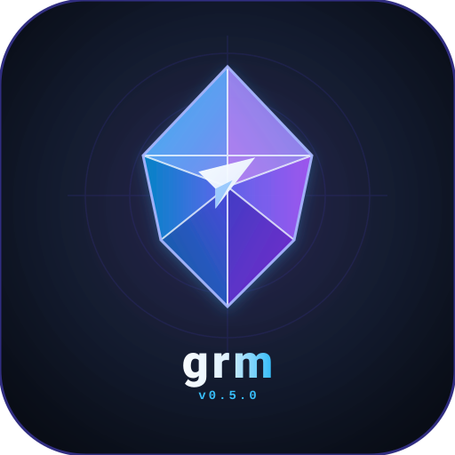

==================================
grm — Group & Telegram Manager CLI
==================================

**grm** is a high-performance, native **C++23** command-line tool for managing Telegram accounts, supergroups, message history, forum topics, file attachments, and data extractions. Powered directly by Telegram's official C++ engine **TDLib** (``libtdjson``).

:Pipeline Status: `GitLab CI Pipelines <https://gitlab.com/renich/grm/-/pipelines>`_
:License: `GPL-3.0-or-later <https://gitlab.com/renich/grm/-/blob/master/LICENSE>`_
:Language: C++23 (ISO/IEC 14882:2023)
:Engine: Telegram TDLib 1.8.66 (``libtdjson``)
:Primary Repository: `GitLab (gitlab.com/renich/grm) <https://gitlab.com/renich/grm>`_
:GitHub Mirror: `GitHub (github.com/renich/grm) <https://github.com/renich/grm>`_

Why grm?
--------

* **Dual Human/AI UX Engine**: Optimized both for interactive terminal use (ANSI TTY tables, color schemes) and automated AI agent workflows (JSON envelope, NDJSON streams).
* **Native TDLib Engine**: Direct C++ bindings to ``libtdjson`` for zero-hallucination, full MTProto protocol fidelity.
* **Supergroup & Forum Topic First**: Complete lifecycle management for Telegram Supergroups, Forum Topics, custom emoji icons, and thread messages.
* **File Upload & Download Engine**: Streamlined document, photo, video, and media extractions with MIME detection and progress tracking.

Quick Start
-----------

Prerequisites (Fedora Linux)
~~~~~~~~~~~~~~~~~~~~~~~~~~~~

.. code-block:: bash

   sudo dnf install tdlib-devel json-c-devel cmake ninja-build gcc-c++ clang-tools-extra

Building & Installing
~~~~~~~~~~~~~~~~~~~~~

.. code-block:: bash

   # Clone repository
   git clone https://gitlab.com/renich/grm.git
   cd grm

   # Build debug binary (default)
   make

   # Build optimized release binary
   make release

   # Run test suite & linters
   make check
   make lint

   # Install binary & man page for current user (~/.local/bin/grm and ~/.local/share/man/man1/grm.1)
   make install-user

Usage Highlights
----------------

.. code-block:: bash

   # List active chats
   grm chat ls

   # Create a supergroup forum topic with a custom emoji icon
   grm topic create -e 5368560552786271734 -1003750297693 "DevOps Operations"

   # Send a message with Telegram Markdown V2 formatting
   grm msg send -t 2 -1003750297693 "Deployment **successful** to production!"

   # Send document attachment with custom caption
   grm msg send -a /var/log/syslog -C "System logs" -t 2 -1003750297693

   # Export topic message history as JSON for AI LLM context
   grm msg export -f json -o history.json -t 2 -1003750297693

   # Bulk download all photos from a forum topic
   grm file download-all -o ~/Downloads -t 2 --type photo -1003750297693

Documentation & Specs
---------------------

For full manual pages, architecture specifications, and roadmaps:

* `User Guide & Options <docs/user/grm.rst>`_
* `Man Page (man grm) <docs/man/grm.1.rst>`_
* `Functional Specification <docs/functional/spec.rst>`_
* `Technical Architecture Specification <docs/technical/spec.rst>`_
* `Project Roadmap <docs/project/roadmap.rst>`_
* `Contributing Guidelines <CONTRIBUTING.rst>`_

License
-------

Distributed under the terms of the `GNU General Public License v3.0 or later (GPL-3.0-or-later) <LICENSE>`_.
